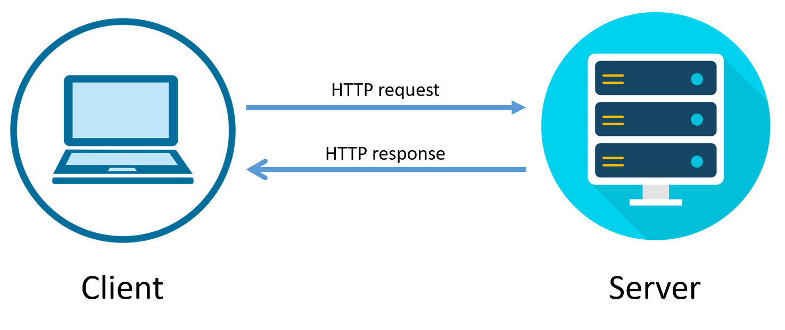
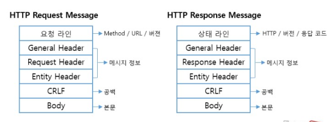
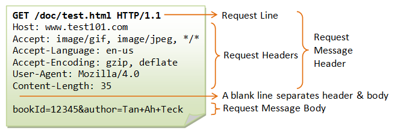

📚💡📕📗📖📄📘🤔✔
# 📚 들어가기 전에    
                  
HTTPS의 등장이유에 대해서는 우리는 안다.                      
HTTP의 등장이유는?                        
그리고 다른 통신과의 차이점은?                        
                                  
요즘은 모든 것이 HTTP 기반 위에서 동작한다.                         
HTML, 이미지 , 영상, 파일뿐만 아니라 앱과 서버의 통신, 서버와 서버의 통신에서도 데이터를 주고 받고 있다.        
특히 백엔드 개발자는 웹 기술들과 웹프레임워크들을 사용할텐데 HTTP 기반으로 구현하고 있다.    
        
HTTP를 제대로 이해하지 못한 상태로 처음 웹 기술들을 공부하면 깊이있게 원리파악 힘듬    
해당 기술들은 이미 HTTP원리를 이미 잘 알고 있다고 가정하고 기능 사용법 위주로 설명함     
예를들어 : SpringMVC의 content negotiation     
이외에도 HTTP 에 관련된 용어들이 나올텐데 이를 잘 모르고 넘어갈 경우가 많음(가볍게 공부할 수 밖에없음)       
          
실무에서 웹 기술을 사용하는 개발자는 늘 고민한다.          
API URL는 어떻게 설계할까?, POST? PUT? HTTP 상태코드는 어떤걸 사용할까?          
그렇기 때문에 HTTP의 핵심 내용을 학습하고 자신만의 학습 기준을 세우고 싶은데       
인터넷 리서칭을 해보면, 자료들이 조각조각 나눠져있고, 잘못된 자료가 많음        
     
그렇다고해서 HTTP 스펙을 보니 모든 내용이 실무에 도움이될까? -> 아니다.      
      
개발자는 평생 HTTP 기반위에서 개발     
언젠가 한번은 HTTP 정리해야함     
  
# 📘 HTTP       
> Hypertext Transfer Protocol 의 약자로, 인터넷상에서 노드간에 데이터 통신을 위한 기초적인 프로토콜         
          
* Application 계층의 프로토콜     
* 인터넷상에서 `HyperText`를 교환하기 위해 사용되기 시작했다.    
* 기본적으로 80번 포트를 사용, WAS 같은 경우 8080을 사용한다.     
* **평문으로 데이터가 전송 된다. - 보안에 안 좋음**        
         
`HyperText`는 다른 파일에 대한 참조 링크인 **하이퍼링크**를 가지고 있으며,              
하이퍼링크를 통해 다른 문서로 이동하거나,        
그 페이지를 운영하는 서버에 데이터(Request)를 보낼 수 있다.           
    
대표적인 `HyperText`는 HTML이 존재하며,      
`JSON`, `XML`은 하이퍼링크와 비슷한 **하이퍼미디어**를 제공하기에 사용이 가능하다.          

**하이퍼 미디어와 하이퍼텍스트의 차이**   
```   
하이퍼미디어 정보는 이용자가 정보를 탐색할 때 어떤 제목에서 관련 제목으로 뛰어넘어 갈 수 있도록 연결되어 있다.      
연결된 정보가 주로 문자 정보로 되어 있으면 하이퍼텍스트이고,      
음악, 영상, 애니메이션 또는 다른 요소가 포함되어 있으면 하이퍼미디어가 된다.    
```
          
✔ 백엔드 개발자 같은 경우 HTML보다는 JSON과 XML을 통해 데이터를 통신하는데 주로 사용한다.                  
과거에는 TCP와 매우 밀접했지만, 현 트렌드가 비동기, 논블록킹으로 전환되면서 UDP와도 관계가 깊어졌다.                 
     
🤔 비동기와 UDP가 같은 의미인지 좀 헷갈리는데 이부분은 잡아주시면 감사하겠습니다.   
   
현재 대부분의 회사에서 모놀리식 아키텍처에서 MSA로 전환이 되고 있는데       
가장 대표적으로 사용하고 있는 기술이 바로, SpringCloud이다.       
SpringCloud는 Netflix OpenSource 를 기반으로 스프링에서 동작하게끔 만들어주고 있다.       
여기서 가장 중요한 것은 Spring API GateWay란 것이 SpringBoot 2.4버전에 등장했는데,       
기본적인 조건이 Java 비동기 통신인 Netty와 SpringWebFlux를 이용해야 한다는 것이다.           
     
SpringWebFlux는 Spring MVC 와 정반대 구조로 EventLoop로 인해 동작한다.   
       
## 📖 HTTP 통신 - Request & Response      

    
            
`Clinet & Server` 구조에서 이용되며 **클라이언트에서 요청(Request)를 보내고 서버는 응답(Response)로 응답해주는 방식이다.**                 
          
웹 서버는 모두 `HTTP Daemon`😈을 가지고 있는데,          
`HTTP Daemon`은 HTTP 요청을 기다리고 있다가 **요청이 들어오면 이를 처리하도록 설계되어 있다.**         

```
HTTP의 입장에서의 웹 브라우저는 서버에 요구를 전달하는 하나의 클라이언트이다.            
사용자가 URL을 입력하거나, 하이퍼텍스트 링크를 클릭 함으로써 데이터를 요구하면, 브라우저는 HTTP 요구를 URL에 적혀있는 IP 주소에 전달한다.            
지정된 서버상의 HTTP Daemon은 그 요구(Request)를 받아서, 필요한 작업이 있다면 처리를 한 뒤에 요구된 데이터를 찾아서 응답한다.             
   
주의점 : 파일이 아닙니다. 데이터를 요청 응답하는 것입니다.    
``` 
   
이전에 배웠던 관련 내용_TCP 를 이용한 HTTP 통신 : [TCP 3-way Handshake](https://github.com/SMART-EYEARS/network/blob/main/03%20TCP%EC%99%80%20UDP.md#-tcp-3-way-handshake), [TCP 4-way Handshake](https://github.com/SMART-EYEARS/network/blob/main/03%20TCP%EC%99%80%20UDP.md#-tcp-4-way-handshake)   
   
## 📖 HTTP Message(Request Message & Response Message)       
     

### 📄 Request Message
> 참고하기 좋은 동영상 : [생활코딩 RequestMessage](https://opentutorials.org/course/3385/21674)    
   


**🔖 RequestMessageHeader**  
`RequestMessageHeader == RequestLine + RequestHeader`  
HTTP Request Message는 Start Line, Headers, Message Body로 이루어져있다.      

**RequestLine**        
해당 요청 또는 응답에 대한 성공 또는 실패를 기록하며 항상 한줄로 끝난다.        
* **`[HTTP Method](#http-method)`+ `Request Target` + `Http protocol version`**   
    
**RequestHeader**   
해당 요청 또는 응답에 대한 메타데이터가 들어가며,        
요청에 대한 설명, 혹은 메시지 본문에 대한 설명이 들어간다.          
* Host : 서버의 도메인 주소 (DNS)  
* Accpet : 브라우저가 처리할 수 있는 데이터의 형태   
* Accept-Language : 서버가 돌려주기로 예상된 언어
* Accept-Encoding : 브라우저가 처리할 수 있는 컨텐츠 인코딩 압축 방식
* Content-Length : 메세지의 본문 크기를 byte단위로 표시
* User-Agent : 사용자의 웹 브라우저 종류&버전 정보   
  
위 내용들은 아직, 외울 필요없다. 나중에 구글링을 통해 검색하면 된다.    
보다 자세한 내용은 [MDN Web Docs-HTTP 헤더](https://developer.mozilla.org/ko/docs/Web/HTTP/Headers)
   
**🔖 Request Message Body**              
요청과 관련된 내용(HTML 폼 콘텐츠 등)이 옵션으로 들어가거나, 응답과 관련된 문서(document)가 들어간다.     
본문의 존재 유무 및 크기는 첫 줄과 Requestheader에 명시된다.         
`POST` 요청의 경우 **업데이트를 하기 위해 서버에 데이터를 전송한다.**                   
`GET`, `HEAD`, `DELETE` , `OPTIONS`처럼 **리소스를 가져오는 요청은 보통 본문이 필요가 없다.**       
쉽게 설명하면, 데이터를 전송하려면 body 이용, 가져오려면 header 에 존재하는 url에 쿼리 이용           
`RequestMessageHeader`와 `RequesetMeessageBody` 사이에는 한 줄의 공백이 있다.                     
  
  
   
**정리**      
* **`HTTP Head` = `start-line` + `HTTP Headers`**
* **`HTTP Body` = `payload (실질적으로 전송의 목적이 되는 데이터 부분)**

### 📄 Response Message   
> 참고하기 좋은 동영상 : [생활코딩 ResponseMessage](https://opentutorials.org/course/3385/21675)    
   
    
  


  
# 참고 
[sdc337dc님의 블로그](https://velog.io/@sdc337dc/%EC%9B%B9-%EA%B0%9C%EB%85%90-Http-%ED%86%B5%EC%8B%A0)       
[ss-won님의 블로그](https://velog.io/@ss-won/%EB%84%A4%ED%8A%B8%EC%9B%8C%ED%81%AC-HTTP-Message%EC%99%80-Status-Code)     


# 📗 HTTPS   
# 📕REST API    
