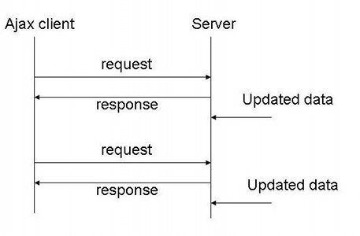
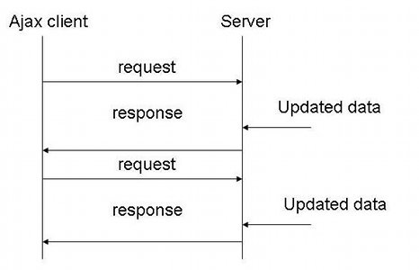

# 08 HTTP 양방향 통신
## Realtime Web     
> 인터넷에서 사용자들로 하여금 창작자가 정보를 만들어내는 즉시 수신할 수 있도록하는 기술 혹은 서비스   

**전통적인 웹**   
* 웹은 HTTP-요청-응답 모델을 기반으로 구축됐다.      
* HTTP는 무상태 프로토콜이며 클라이언트와 서버 간의 통신은 각각의 독립적ㅇ니 요청과 응답의 쌍으로 구성된다.    
* 웹 브라우저에서 폼을 채우고 이를 웹 서버로 제출하는 하나의 요청으로    
웹 서버는 요청된 내용에 ㄸ라ㅏ서 데이터를 가공하여 새로운 웹 페이지를 작성하고 응답으로 되돌려준다.
  
**AJAX*     
* 사용자 인터페이스 나머지 부분을 방해하지 않고 비동기로 데이터를 송/수신할 수 있다.       
* 전체 페이지를 다시 로딩하는 것이 아닌 일부분만 변경하기 때문에 빠른 화면 전환이 가능하다.   

**kwj1270의 생각 : 그렇다면 왜 AJAX 이전에는 실시간을 못햇지? 🤔**     
AJAX는 전체 페이지를 로딩하는 것이 아닌, 일부분만 데이터를 로딩시킬 수 있게 해준다.        
사실, 이는 비동기적인 방식으로 기존 작업들은 그대로 돌지만 특정 부분만 변경에 대한 요청을 하는 것이다.      
이런, 비동기가 아니라면 

## Polling     
   
       
      
Polling 이란, 클라이언트가 서버에게 주기적으로 Request를 보내는 방식을 의미한다.        
단, 이때 전송할 데이터의 유무를 따지지 않기 때문에 Response로는 빈 데이터/실패 데이터를 받는다.      

1.주기적으로 물어보므로 응답 간격을 일정하게 할 수 있다.
2.주기적으로 몰아서 물어보는게 가능하므로 자동으로 배치프로세싱(일괄처리)되어서 db튜닝을 하는 효과가 나온다.
3.실시간으로 주는건 불가능하다. 실시간 효과를 내려면 간격을 줄여야 하지만 서버와 클라이언트 모두에게 부담이다.
4.보낼데이터가 없어도 계속해서 데이터를 줘야하므로 서버의 리소스를 낭비하게된다

특정 주기를 가지고 그 주기 마다 처리를 위한 시그널이 들어 왔는지를 체크 합니다.
따라서 커널과 같은 Interrupt Handler가 필요하지 않습니다.

     
