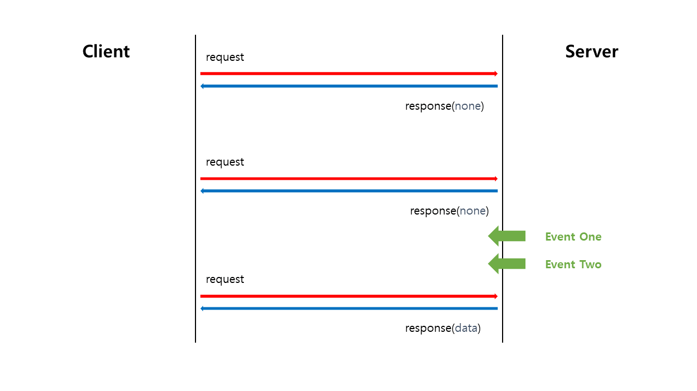
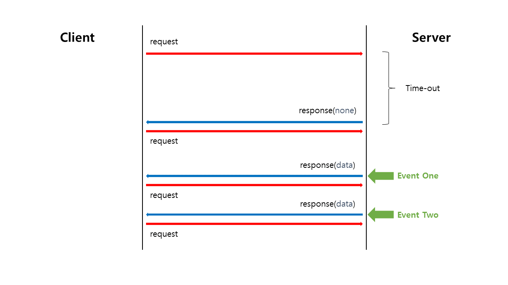

# 08 HTTP 양방향 통신
## Realtime Web     
> 인터넷에서 사용자들로 하여금 창작자가 정보를 만들어내는 즉시 수신할 수 있도록하는 기술 혹은 서비스   

**전통적인 웹**   
* 웹은 HTTP-요청-응답 모델을 기반으로 구축됐다.      
* HTTP는 무상태 프로토콜이며 클라이언트와 서버 간의 통신은 각각의 독립적인 요청과 응답의 쌍으로 구성된다.    
* 웹 브라우저에서 폼을 채우고 이를 웹 서버로 제출하는 하나의 요청으로    
웹 서버는 요청된 내용에 따라서 데이터를 가공하여 새로운 웹 페이지를 작성하고 응답으로 되돌려준다. 
   
이 같이 요청이 있을 때마다 페이지를 새로 그리는 작업을 `포스트 백`이라 부른다.    
   
**AJAX의 등장**        
* 사용자 인터페이스 나머지 부분을 방해하지 않고 비동기로 데이터를 송/수신할 수 있다.       
* 전체 페이지를 다시 로딩하는 것이 아닌 일부분만 변경하기 때문에 빠른 화면 전환이 가능하다.   
            
**추가 정리**               
위 내용을 읽으면서 헷갈릴 수 있는 부분이 있을 것 같아 조금 더 설명을 하고자 한다.               
전통적인 웹에서 Request로 받는 것은 `웹페이지`뿐만 아니라 특정 부분의 `데이터`도 받을 수 있다.    
우리가 알만한 내용으로 말하자면, Controller 방식과 RestController 방식 둘다 사용할 수 있다.   
단, 문제가 무엇이냐면 페이지를 새로 받는다 하면 이를 다시 로드해야하고         
특정 부분의 데이터를 받는다 하더라도 이를 반영하기 위해서는 응답이 올 때까지 기다려야한다.   

결국, 데이터의 수정이 이루어지면 결과물이 어떻든 페이지를 리로딩해야 한다는 것이다.           
  
하지만, 이때 등장한 것이 **비동기 방식의 `AJAX`** 이다.          
비동기 방식은 `이벤트 루프` 기반으로 기존 작업을 수행하고 있다가       
이벤트가 발생하면(위 같은 상황이면 응답이 왔을 경우)이에 맞는 처리를 할 수 있다.  


페이지를 다시 로딩한다기 보단, **비동기에 초점**이 맞춰져있다고 생각이 든다.               
사실, 일반적인 Request를 보내더라도 Response는 오게 되어있다.                 
단, 이를 


그렇기에, 필자의 생각은 `RealTimeWeb`은 


AJAX를 이용하면 페이지의 로딩없이 값을 변경시킬 수 있다.   


AJAX는 전체 페이지를 로딩하는 것이 아닌, 일부분만 데이터를 로딩시킬 수 있게 해준다.        
사실, 이는 비동기적인 방식으로 기존 작업들은 그대로 돌지만 특정 부분만 변경에 대한 요청을 하는 것이다.      
이런, 비동기가 아니라면 

   
## Polling       
   

```javascript
const delay = (ms) => new Promise((resolve) => setTimeout(resolve, ms))

const fetchPosts = (cursor) =>
  fetch('/api/posts?cursor=&{cursor}')
    .then((response) => response.json())
    .then(prependPosts)
   
async function polling() {
  while (true) {
    await delay(1000)  
    await fetchPosts($posts.firstElementChild.dataset.postId)
  }
}   

fetchPosts(0).then(polling)  
```

Polling 이란, 클라이언트가 서버에게 주기적으로 Request를 보내는 방식을 의미한다.              
서버가 클라이언트에게 알려야 할 이벤트가 주기적으로 발생할 때에는 비용 대비 효과가 가장 좋다는 특징을 가지고 있다.   
단, 이때 전송할 데이터의 유무를 따지지 않기 때문에 Response로는 빈 데이터/실패 데이터를 받는다.      
   
우선, Polling의 장점과 단점은 아래와 같다.      
     
**Polling의 장점**         
1. 주기적으로 물어보므로 응답 간격을 일정하게 할 수 있다.     
2. 주기적으로 몰아서 물어보는게 가능하므로 자동으로 **배치프로세싱(일괄처리)되어서 db튜닝을 하는 효과**가 나온다.     
3. 요청/응답이 주기적으로 일정하기 때문에 네트워크 부하를 예측할 수 있는 일정 수준으로 정적으로 유지할 수 있다. 
4. 특정 주기를 가지고 그 주기 마다 처리를 위한 시그널이 들어 왔는지를 체크 하기에     
따라서 커널과 같은 `Interrupt Handler`가 필요하지 않는다.       
    
**Polling 의 단점**                  
1. 실시간과 비슷한 효과를 내려면 요청 간격을 줄여야 하지만 서버와 클라이언트 모두에게 부담이다.             
2. 서버에서는 보낼 데이터가 없어도 계속해서 데이터를 줘야하므로(공백/실패) 서버의 리소스를 낭비하게된다.          
3. 요청이 서버로 **전송되는 데 소요되는 시간**도 불규칙할 수 있기에, 클라이언트의 주기와 서버의 주기가 엇갈리는 때도 많다.     
     
이렇듯 Polling 기법은 단순하지만, 너무 많은 `Requset/Response`전송, `Resource` 사용으로        
클라이언트와 서버 양쪽에 무리를 주는 단점이 있고            
무엇보다 `Polling` 방식에 초점을 두어 프로그래밍을 해야 한다는 문제가 있다. (완벽한 Polling을 위해)            
   
## Long Polling   
Long Polling 방식은 일반 Polling 방식과 포맷은 같다.        
단, Polling 방식과의 차이점으로는 `time out`될 때까지 기다린다는 것이다.     
       
         
            
Long Polling 방식은 요청을 보내고 제**한시간내에 이벤트가 발생하면 데이터를 받는 방식**이다.                    
만약 데이터를 받지 못했다 하더라도, `Clinet`에서는 바로 다시 서버에 요청을 보낸다.                       
이 결과, 연결은 무한히 지속되게 되며 client는 마치 실시간으로 데이터를 받는 느낌을 받게 된다.            
LongPolling은 Polling과 조금 다르게 **지속적인 연결을 목표로 하고 있다.**                  
그렇기에 서버로부터 응답을 받을 때만 다시 요청을 날리는 방식으로 Polling의 문제점을 해결했다.             
            
**하지만,**               
LongPolling에도 단점은 존재한다.            
데이터가 주어지는 즉시 바로바로 반응하고 보내므로          
**이벤트 발생 빈도가 매우 높을 때에는, Polling보다 더 큰 네트워크 부하가 발생**할 수 있다.             
       
따라서 이벤트 발생 빈도가 높은 상황에서 Long Polling을 적용할 때에는,      
[네이글 알고리즘(Nagle's Algorithm)](https://snowdeer.github.io/common-sense/2017/08/17/nagle-algorithm/)의 도입을 검토해서 과도한 부하 발생을 방지하는 보완 조치가 필요하다.  
         
**네이글 알고리즘**에 대해서 쉽게 설명하면           
우선 순위가 높은 메시지는 즉각 회신하도록 하고,          
우선 순위가 낮은 메시지는 개수 또는 크기 기준으로 일정량을 넘을 때만 서버가 응답을 보내는 알고리즘이다.    
**버퍼와 같은 동작을 처리하는 알고리즘이라 생각하면 된다.**       


# 개인적인 궁금증 다 같이 토론해봐요👨‍🏫

