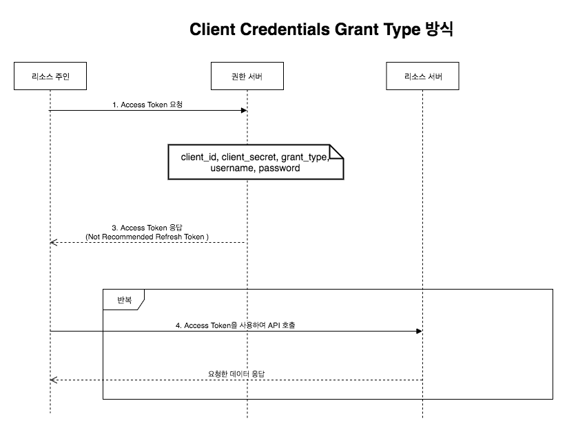

# 10 OAuth VS OAuth2
## OAuth의 등장배경  
OAuth는 인증을 위한 오픈 스탠더드 프로토콜로,           
사용자가 특정 애플리케이션의 기능을 다른 애플리케이션에서도 사용할 수 있게 한 것이다.      
            
OAuth 1.0이 나온 때는 2007년이며(비공식 논의 체제),             
이후 보안 문제를 해결한 수정 버전인 OAuth 1.0 revision A 가 2008년에 나왔다.            
2010년 IETF OAuth 워킹그룹에 의해 IETF 표준 프로토콜로 발표되었다.          

## OAuth와 로그인 


1. `외부 손님`이 안내 데스크에서 업무적인 목적으로 `대표`를 만나러 왔다고 말한다.
2. 안내 데스크에서는 `대표`에게 `외부 손님`이 방문했다고 연락한다.
3. `대표`가 안내 데스크로 찾아와 `외부 손님`의 신원을 확인해 준다.
4. `대표`는 업무 목적과 인적 사항을 안내 데스크에서 기록한다.
5. 안내 데스크에서 `외부 손님`에게 **방문증**을 발급해 준다.
6. `대표`와 `외부 손님`은 정해진 장소로 이동해 업무를 진행한다.
   
OAuth를 이용하여 사용자를 인증을 하는 과정을 OAuth Dance라고 한다.      
두 명이 춤을 추듯 정확하게 정보를 주고받는 과정을 재미있게 명명한 것이다.   

`방문증`이란 사전에 정해진 곳만 다닐 수 있도록 하는 것이니,       
**`방문증`** 을 가진 사람이 출입할 수 있는 곳과 **`사원증`** 을 가진 사람이 **출입할 수 있는 곳은 다르다.**         
역시 **`직접 서비스에 로그인한 사용자`** 와 **`OAuth를 이용해 권한을 인증받은 사용자`** 는 **할 수 있는 일이 다르다.**    

OAuth에서 'Auth'는 **⭐️'Authentication'(인증)뿐만 아니라 'Authorization'(인가) 또한 포함하고 있는 것이다.⭐️**         
그렇기 때문에 OAuth 인증을 진행할 때 해당 서비스 제공자는       
`제 3자가 어떤 정보나 서비스에 사용자의 권한으로 접근하려 하는데 허용하겠느냐`라는 안내 메시지를 보여 주는 것이다.       
  

## OAuth 1.0

   
      
|회사 방문 과정|OAuth 인증 과정|      
|----------|-------------|     
|1. `외부 손님`이 안내 데스크에서 업무적인 목적으로 `대표`를 만나러 왔다고 말한다.|Request Token의 요청과 발급|
|2. 안내 데스크에서는 `대표`에게 `외부 손님`이 방문했다고 연락한다.|사용자 인증 페이지 호출|
|3. `대표`가 안내 데스크로 찾아와 `외부 손님`의 신원을 확인해 준다.|사용자 로그인 완료|
|4. `대표`는 업무 목적과 인적 사항을 안내 데스크에서 기록한다.|사용자의 권한 요청 및 수락|
|5. 안내 데스크에서 `외부 손님`에게 **방문증**을 발급해 준다.|Access Token 발급|
|6. `대표`와 `외부 손님`은 정해진 장소로 이동해 업무를 진행한다.|Access Token을 이용해 서비스 정보 요청|

OAuth 의 동작 과정은 위와 같은 형태로 진행된다.   
위 표를 기준으로, `Access Token`은 방문증이라고 이해할 수 있다.    
이 방문증으로 사전에 허락된 공간에 출입할 수 있다.    

## OAuth2 
OAuth는 인증을 위한 오픈 스탠더드 프로토콜로,     
애플리케이션에서 **서드파티 기업의 서비스를 사용할 수 있게끔 만들어진 범용적인 표준 인증 프로토콜이다.**         
그리고 이러한 OAuth **토큰을 사용한 범용적인 방법의 인증을 제공한다**

```
서드파티 : 제 3자라는 뜻, 여기서는 프로토콜이나 관련된 사항이 아닌 다른 리소스를 말합니다.   
```      
   
**`OAuth2`에서 제공하는 승인 타입은 총 4가지**    

1. **권한 부여 코드 승인 타입(Authorization Code Grant Type) :**    
    * 클라이언트(애플리케이션)가 사용자 대신 특정 리소스에 접근을 요청할 때 사용된다.       
    * 리소스 접근을 위한 **`사용자명`** 과 **`비밀번호`** , '권한 서버'에 요청해서 받은 **`권한 코드`** 를 함께 활용하여    
    리소스에 대한 액세스 토큰을 받으면 이를 인증에 이용하는 방식이다.           
    * 즉, `Id+Password+사용자 권한 토큰`을 활용하여 서드파티의 `Accecs토큰`을 받아 이를 활용해 서비스를 이용하는 것이다.          
2. **암시적 승인 타입 (Implicit Grant Type) :**         
    * `권한 부여 코드 승인 타입`과 `권한 코드 교환 단계` 없이 액세스 토큰을 즉시 반환받아 이를 인증에 이용하는 방식이다.     
3. **리소스 소유자 암호 자격 증명 승인 타입(Resource Owner Password Credentials Grant Type) :**      
    * 클라이언트(애플리케이션)가 암호를 사용하여 액세스 토큰에 대한 사용자의 자격 증명을 교환하는 방식입니다.       
4. **클라이언트 자격 증명 승인 타입(Client Credentials Grant Type) :**      
    * 클라이언트(애플리케이션)가 컨텍스트 외부에서 액세스 토큰을 얻어 특정 리소스에 접근을 요청할 때 사용하는 방식입니다.   
     
눈 여겨볼 방식은 `권한 부여 코드 승인 타입(Authorization Code Grant Type)` 이다.   
페이스북, 구글, 카카오 등의 소셜 미디어들이 웹 서버 형태의 클라이언트를 지원하는 데 이 방식을 사용한다.      
이 방식은 **장기 액세스 토큰을 사용하여 사용자 인증을 처리한다.**      

### 권한 부여 코드 승인 타입(Authorization Code Grant Type)  

     
         
위 시퀀스 다이어그램에 표시된 각 주체는 아래와 같다.              
               
* **리소스 주인 :** 인증이 필요한 사용자, 애플리케이션을 사용하는 사용자                        
* **클라이언트 :** 웹사이트(애플리케이션)                           
* **권한 서버 :** 페이스북/구글/카카오 서버                   
* **리소스 서버 :** 페이스북/구글/카카오 서버                  
             
1. 클라이언트가 파라미터로 **클라이언트 ID**, **리다이렉트 URI**, **응답 타입**을 지정하여 권한 서버에 전달한다.       
2. 정상적으로 인증이 되면 **권한 부여 코드**를 클라이언트에 보냅니다.        
3. 클라이언트는 `권한 부여 코드`를 사용하여 **액세스 토큰 발급** 을 권한 서버에 요청한다.    
    * 이때 필요한 파라미터는 아래와 같다.  
      * **`클라이언트 ID` :** 애플리케이션이 서드파티 API 사용을 위해 등록한 ID  
      * **`클라이언트 비밀번호` :** 애플리케이션이 서드파티 API 사용을 위해 등록한 비밀번호(SecretKey)   
      * **`리다이렉트 URI` :** 해당 애플리케이션을 식별하고 식별값(Access token)을 전달할 통로
      * **`인증 타입` :** 코드      
4. 마지막으로 응답받은 액세스 토큰을 사용하여 리소스 서버에 사용자의 데이터를 요청합니다.  
   
      
**OAuth2 방식은 ID와 PW가 일치하는지 최소 3번 요청한다.**    
하지만, `OAuth2`는 회원가입 없이 이미 사용하는 소셜 미디어 계정으로 인증하기 때문에       
사용자 입장에서는 더욱 편리하게 로그인 처리할 수 있다.   
서비스 측면에서는 회원 가입 관련 기능을 축소키시고    
소셜에서 제공하는 `User`정보를 가져올 수 있어 편리하다. (관리는 서드파티에서)      
        
여기서 `권한 부여 코드 승인 타입`의 흐름을 이해하는 것은 굉장히 중요합니다.   
스프링이 아닌 다른 어떤 라이브러리도 이 흐름을 바탕으로 코드를 구현하기 때문이다.    

### 암시적 승인 타입 (Implicit Grant Type)

     

1. 클라이언트가 파라미터로 **클라이언트 ID**, **리다이렉트 URI**, **응답 타입**을 지정하여 권한 서버에 전달한다.       
2. 정상적으로 인증이 되면 **액세스 토큰**을 클라이언트에 보냅니다.        
3. 클라이언트는 **액세스 토큰 검증** 을 권한 서버에 요청한다.    
4. 마지막으로 검증받은 액세스 토큰을 사용하여 리소스 서버에 사용자의 데이터를 요청합니다.     
   
### 리소스 소유자 암호 자격 증명 승인 타입(Resource Owner Password Credentials Grant Type)


1. 클라이언트에서 바로 인증을 진행하며 대부분 ID, Password를 통해서 자격 증명이 진행된다.
2. 넘겨 받은 정보기반으로 권한 서버에 Access Token 정보를 요청한다.
3. Access Token 정보를 응답 받습니다. 이때 Refresh Token 정보도 넘겨 줄 수도 있다.
4. Access Token 기반으로 Resource Server와 통신한다.

### 클라이언트 자격 증명 승인 타입(Client Credentials Grant Type)  

 
   
1. Access Token 정보를 요청한다.     
2. Access Token 정보를 응답한다. 이때 Refresh Token 정보는 응답하지 않는 것을 권장한다.       
3. Access Token 기반으로 Resource Server와 통신한다.   
    

## OAuth 매개변수      
    
|용어|설명|
|---|-----------|
|User|Service Provider에 계정을 가지고 있으면서, Consumer를 이용하려는 사용자|    
|Service Provider|OAuth를 사용하는 Open API를 제공하는 서비스|    
|Consumer|OAuth 인증을 사용해 Service Provider의 기능을 사용하려는 애플리케이션이나 웹 서비스|     
|Request Token|Consumer가 Service Provider에게 접근 권한을 인증받기 위해 사용하는 값.<br>인증이 완료된 후에는 Access Token으로 교환한다.|     
|Access Token|인증 후 Consumer가 Service Provider의 자원에 접근하기 위한 키를 포함한 값|       

### Request Token
OAuth에서,       
`Consumer`가 `Request Token`발급을 요청하고      
`Service Provider`가 `Request Token`을 발급한다.        

**예시**
```http
GET http://nid.naver.com/naver.oauth?mode=req_req_token&  
  oauth_callback=http://example.com/OAuthRequestToken.do&  
  oauth_consumer_key=WEhGuJZWUasHg&  
  oauth_nonce=zSs4RFI7lakpADpSsv&   
  oauth_signature=wz9+ZO5OLUnTors7HlyaKat1Mo0=&  
  oauth_signature_method=HMAC-SHA1&  
  oauth_timestamp=1330442419&  
  oauth_version=1.0 HTTP/1.1
Accept-Encoding: gzip, deflate  
Connection: Keep-Alive  
Host: nid.naver.com  
```

**Request Token 발급 요청시 사용하는 매개변수**   

|매개변수|설명|
|------|---|
|oauth_callback|Service Provider가 인증을 완료한 후 리다이렉트할 Consumer의 웹 주소.<br>만약 Consumer가 웹 애플리케이션이 아니라 리다이렉트할 주소가 없다면<br>소문자로 'oob'(Out Of Band라는 뜻)를 값으로 사용한다.|
|oauth_consumer_key|Consumer를 구별하는 키 값.<br>Service Provider는 이 키 값으로 Consumer를 구분한다.|
|oauth_nonce|Consumer에서 임시로 생성한 임의의 문자열.<br>oauth_timestamp의 값이 같은 요청에서는 유일한 값이어야 한다.<br>이는 악의적인 목적으로 계속 요청을 보내는 것을 막기 위해서이다.|
|oauth_signature|OAuth 인증 정보를 암호화하고 인코딩하여 서명 값.<br>OAuth 인증 정보는 매개변수 중에서 oauth_signature를 제외한 나머지 매개변수와 HTTP 요청 방식을 문자열로 조합한 값이다.<br>암화 방식은 oauth_signature_method에 정의된다.|
|oauth_signature_method|oauth_signature를 암호화하는 방법.<br>HMAC-SHA1, HMAC-MD5 등을 사용할 수 있다.|
|oauth_timestamp|요청을 생성한 시점의 타임스탬프.<br>1970년1월 1일 00시 00분 00초 이후의 시간을 초로 환산한 초 단위의 누적 시간이다.|
|oauth_version|OAuth 사용 버전.<br>1.0a는 1.0이라고 명시하면 된다.|


### 
###
###
###
