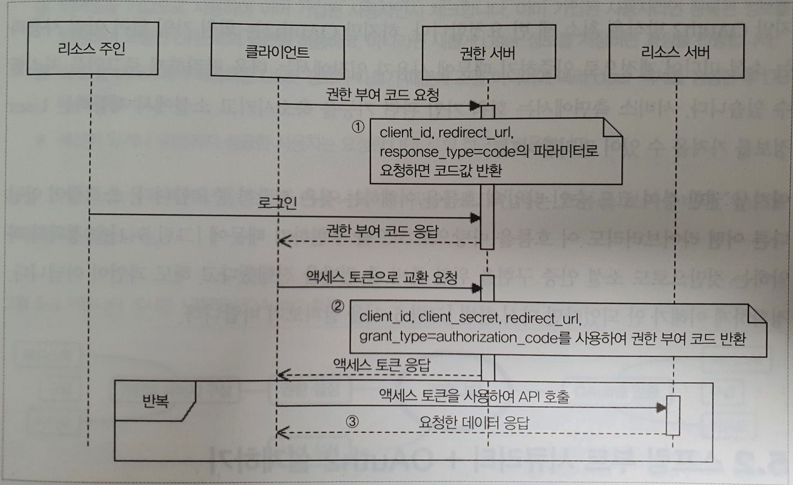

# 10 OAuth VS OAuth2
## OAuth2 
OAuth는 인증을 위한 오픈 스탠더드 프로토콜로,     
애플리케이션에서 **서드파티 기업의 서비스를 사용할 수 있게끔 만들어진 범용적인 표준 인증 프로토콜이다.**         
그리고 이러한 OAuth **토큰을 사용한 범용적인 방법의 인증을 제공한다**

```
서드파티 : 제 3자라는 뜻, 여기서는 프로토콜이나 관련된 사항이 아닌 다른 리소스를 말합니다.   
```      
   
**`OAuth2`에서 제공하는 승인 타입은 총 4가지**    

1. **권한 부여 코드 승인 타입(Authorization Code Grant Type) :**    
    * 클라이언트(애플리케이션)가 사용자 대신 특정 리소스에 접근을 요청할 때 사용된다.       
    * 리소스 접근을 위한 **`사용자명`** 과 **`비밀번호`** , '권한 서버'에 요청해서 받은 **`권한 코드`** 를 함께 활용하여    
    리소스에 대한 액세스 토큰을 받으면 이를 인증에 이용하는 방식이다.           
    * 즉, `Id+Password+사용자 권한 토큰`을 활용하여 서드파티의 `Accecs토큰`을 받아 이를 활용해 서비스를 이용하는 것이다.          
2. **암시적 승인 타입 (Implicit Grant Type) :**         
    * `권한 부여 코드 승인 타입`과 `권한 코드 교환 단계` 없이 액세스 토큰을 즉시 반환받아 이를 인증에 이용하는 방식이다.     
3. **리소스 소유자 암호 자격 증명 승인 타입(Resource Owner Password Credentials Grant Type) :**      
    * 클라이언트(애플리케이션)가 암호를 사용하여 액세스 토큰에 대한 사용자의 자격 증명을 교환하는 방식입니다.       
4. **클라이언트 자격 증명 승인 타입(Client Credentials Grant Type) :**      
    * 클라이언트(애플리케이션)가 컨텍스트 외부에서 액세스 토큰을 얻어 특정 리소스에 접근을 요청할 때 사용하는 방식입니다.   
     
눈 여겨볼 방식은 `권한 부여 코드 승인 타입(Authorization Code Grant Type)` 이다.   
페이스북, 구글, 카카오 등의 소셜 미디어들이 웹 서버 형태의 클라이언트를 지원하는 데 이 방식을 사용한다.      
이 방식은 **장기 액세스 토큰을 사용하여 사용자 인증을 처리한다.**      
   
     
         
위 시퀀스 다이어그램에 표시된 각 주체는 아래와 같다.              
               
* **리소스 주인 :** 인증이 필요한 사용자, 애플리케이션을 사용하는 사용자                        
* **클라이언트 :** 웹사이트(애플리케이션)                           
* **권한 서버 :** 페이스북/구글/카카오 서버                   
* **리소스 서버 :** 페이스북/구글/카카오 서버                  
             
1. 클라이언트가 파라미터로 **클라이언트 ID**, **리다이렉트 URI**, **응답 타입**을 지정하여 권한 서버에 전달한다.       
2. 정상적으로 인증이 되면 **권한 부여 코드**를 클라이언트에 보냅니다.        
3. 클라이언트는 `권한 부여 코드`를 사용하여 **액세스 토큰 발급** 을 권한 서버에 요청한다.    
    * 이때 필요한 파라미터는 아래와 같다.  
      * **`클라이언트 ID` :** 애플리케이션이 서드파티 API 사용을 위해 등록한 ID  
      * **`클라이언트 비밀번호` :** 애플리케이션이 서드파티 API 사용을 위해 등록한 비밀번호(SecretKey)   
      * **`리다이렉트 URI` :** 해당 애플리케이션을 식별하고 식별값(Access token)을 전달할 통로
      * **`인증 타입` :** 코드/토큰      
4. 마지막으로 응답받은 액세스 토큰을 사용하여 리소스 서버에 사용자의 데이터를 요청합니다.  
   
      
**OAuth2 방식은 ID와 PW가 일치하는지 최소 3번 요청한다.**    
하지만, `OAuth2`는 회원가입 없이 이미 사용하는 소셜 미디어 계정으로 인증하기 때문에       
사용자 입장에서는 더욱 편리하게 로그인 처리할 수 있다.   
서비스 측면에서는 회원 가입 관련 기능을 축소키시고    
소셜에서 제공하는 `User`정보를 가져올 수 있어 편리하다. (관리는 서드파티에서)      
        
여기서 `권한 부여 코드 승인 타입`의 흐름을 이해하는 것은 굉장히 중요합니다.   
스프링이 아닌 다른 어떤 라이브러리도 이 흐름을 바탕으로 코드를 구현하기 때문이다.    
